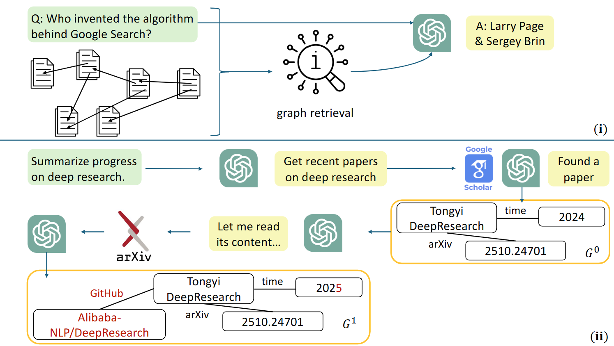
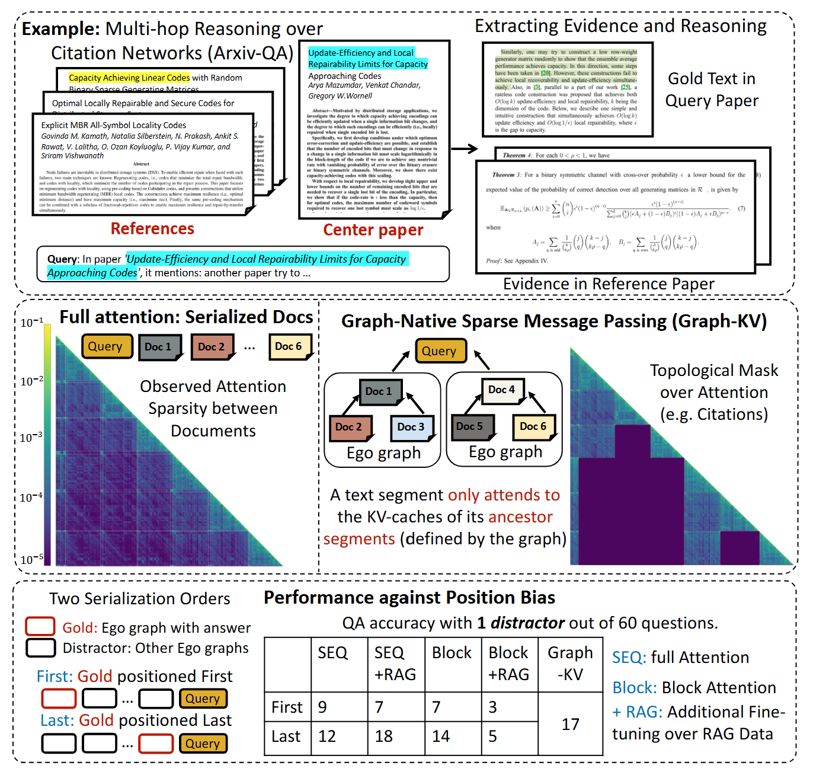
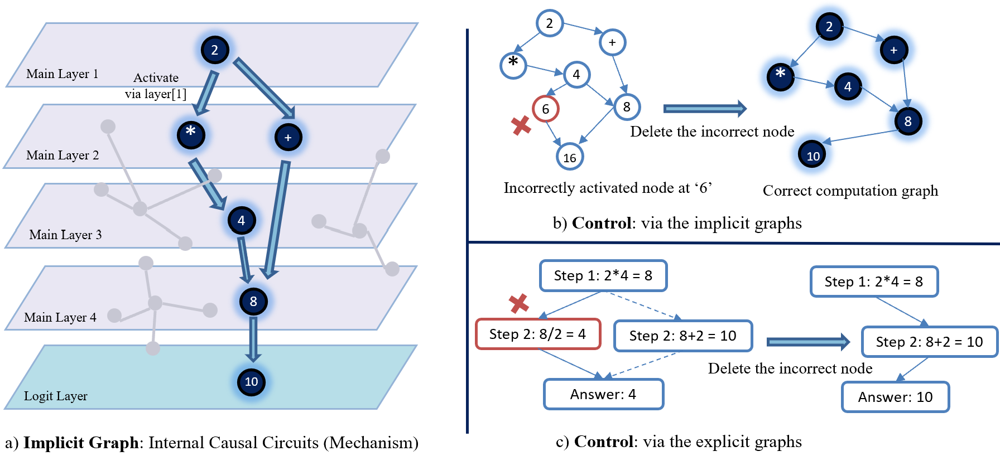
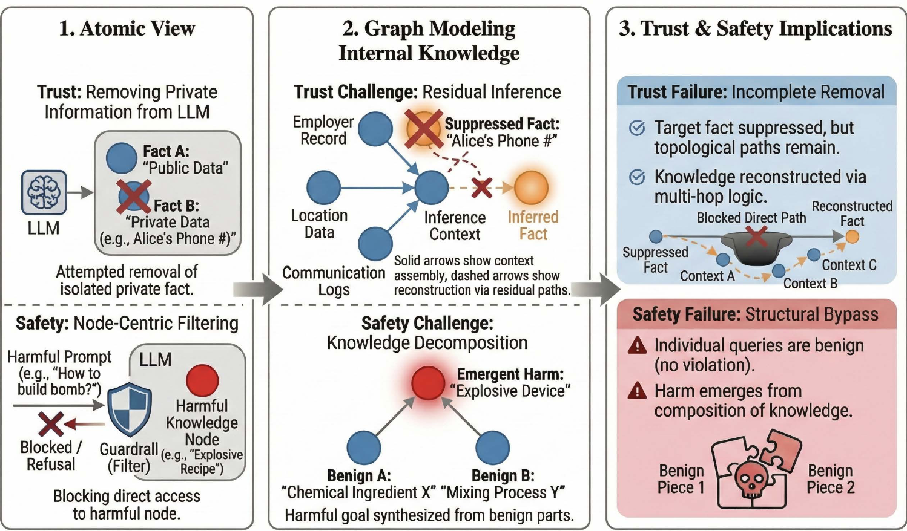

# Awesome-Graph4TruthLLM

## Graph-Based Context Engineering

  

- [A Survey of Context Engineering for Large Language Models](https://arxiv.org/abs/2507.13334) - arXiv 2025
- [Retrieval-Augmented Generation for Knowledge-Intensive NLP Tasks](https://arxiv.org/abs/2005.11401) - NeurIPS 2020
- [Retrieval Meets Long Context Large Language Models](https://openreview.net/forum?id=xw5nxFWMlo) - ICLR 2024
- [HippoRAG: Neurobiologically Inspired Long-Term Memory for Large Language Models](https://arxiv.org/abs/2405.14831) - NeurIPS 2024
- [From Local to Global: A Graph RAG Approach to Query-Focused Summarization](https://arxiv.org/abs/2404.16130) - arXiv 2024
- [STaRK: Benchmarking LLM Retrieval on Textual and Relational Knowledge Bases](https://arxiv.org/abs/2404.13207) - NeurIPS 2024
- [G-Retriever: Retrieval-Augmented Generation for Textual Graph Understanding and Question Answering](https://arxiv.org/abs/2402.07630) - NeurIPS 2024
- [GNN-RAG: Graph Neural Retrieval for Efficient Large Language Model Reasoning on Knowledge Graphs](https://aclanthology.org/2025.findings-acl.856/) - Findings ACL 2025
- [GFM-RAG: Graph Foundation Model for Retrieval Augmented Generation](https://arxiv.org/abs/2502.01113) - NeurIPS 2025
- [RAG vs. GraphRAG: A Systematic Evaluation and Key Insights](https://arxiv.org/abs/2502.11371) - arXiv 2025
- [Don't Forget to Connect! Improving RAG with Graph-Based Reranking](https://arxiv.org/abs/2405.18414) - arXiv 2024
- [When to Use Graphs in RAG: A Comprehensive Analysis for Graph Retrieval-Augmented Generation](https://arxiv.org/abs/2506.05690) - arXiv 2025
- [Haystack Engineering: Context Engineering for Heterogeneous and Agentic Long-Context Evaluation](https://arxiv.org/abs/2510.07414) - arXiv 2025
- [Simple Is Effective: The Roles of Graphs and Large Language Models in Knowledge-Graph-Based Retrieval-Augmented Generation](https://openreview.net/forum?id=JvkuZZ04O7) - ICLR 2025
- [Mem0: Building Production-Ready AI Agents with Scalable Long-Term Memory](https://arxiv.org/abs/2504.19413) - arXiv 2025
- [A-MEM: Agentic Memory for LLM Agents](https://arxiv.org/abs/2502.12110) - arXiv 2025
- [Zep: A Temporal Knowledge Graph Architecture for Agent Memory](https://arxiv.org/abs/2501.13956) - arXiv 2025
- [Scaling Long-Horizon LLM Agent via Context-Folding](https://arxiv.org/abs/2510.11967) - arXiv 2025
- [AgentFold: Long-Horizon Web Agents with Proactive Context Management](https://arxiv.org/abs/2510.24699) - arXiv 2025
- [Graph-R1: Towards Agentic GraphRAG Framework via End-to-End Reinforcement Learning](https://arxiv.org/abs/2507.21892) - arXiv 2025

## Graph Priors for LLM Architectures

  

- [MInference 1.0: Accelerating Pre-Filling for Long-Context LLMs via Dynamic Sparse Attention](https://arxiv.org/abs/2407.02490) - NeurIPS 2024
- [QUEST: Query-Aware Sparsity for Efficient Long-Context LLM Inference](https://arxiv.org/abs/2406.10774) - ICML 2024
- [H2O: Heavy-Hitter Oracle for Efficient Generative Inference of Large Language Models](https://arxiv.org/abs/2306.14048) - NeurIPS 2023
- [PyramidKV: Dynamic KV Cache Compression Based on Pyramidal Information Funneling](https://arxiv.org/abs/2406.02069) - arXiv 2024
- [SnapKV: LLM Knows What You Are Looking for Before Generation](https://arxiv.org/abs/2404.14469) - NeurIPS 2024
- [KVzip: Query-Agnostic KV Cache Compression with Context Reconstruction](https://arxiv.org/abs/2505.23416) - arXiv 2025
- [SALS: Sparse Attention in Latent Space for KV Cache Compression](https://arxiv.org/abs/2510.24273) - arXiv 2025
- [Reformer: The Efficient Transformer](https://openreview.net/forum?id=rkgNKkHtvB) - ICLR 2020
- [Parallel Context Windows for Large Language Models](https://arxiv.org/abs/2212.10947) - ACL 2023
- [APE: Faster and Longer Context-Augmented Generation via Adaptive Parallel Encoding](https://arxiv.org/abs/2502.05431) - ICLR 2025
- [Block-Attention for Efficient Prefilling](https://arxiv.org/abs/2409.15355) - arXiv 2024
- [Scalable In-Context Ranking with Generative Models](https://arxiv.org/abs/2510.05396) - arXiv 2025
- [Attention Is All You Need](https://arxiv.org/abs/1706.03762) - NeurIPS 2017
- [Graph Attention Networks](https://openreview.net/forum?id=rJXMpikCZ) - ICLR 2018
- [Graph-KV: Breaking Sequence via Injecting Structural Biases into Large Language Models](https://arxiv.org/abs/2506.07334) - arXiv 2025
- [Struc-EMB: The Potential of Structure-Aware Encoding in Language Embeddings](https://arxiv.org/abs/2510.08774) - arXiv 2025
- [Lost in the Middle: How Language Models Use Long Contexts](https://aclanthology.org/2024.tacl-1.9/) - TACL 2024
- [On the Emergence of Position Bias in Transformers](https://openreview.net/forum?id=FqagRiYpsN) - ICML 2025

## Graph-Based Interpretability and Control

  

- [Chain-of-Thought Prompting Elicits Reasoning in Large Language Models](https://arxiv.org/abs/2201.11903) - NeurIPS 2022
- [Measuring Faithfulness in Chain-of-Thought Reasoning](https://arxiv.org/abs/2307.13702) - arXiv 2023
- [Language Models Don't Always Say What They Think: Unfaithful Explanations in Chain-of-Thought Prompting](https://arxiv.org/abs/2305.04388) - NeurIPS 2023
- [Towards Automated Circuit Discovery for Mechanistic Interpretability](https://arxiv.org/abs/2304.14997) - NeurIPS 2023
- [Attribution Patching Outperforms Automated Circuit Discovery](https://aclanthology.org/2024.blackboxnlp-1.25/) - BlackboxNLP 2024
- [On the Biology of a Large Language Model](https://transformer-circuits.pub/2025/attribution-graphs/biology.html) - Transformer Circuits Thread 2025
- [Transcoders Find Interpretable LLM Feature Circuits](https://arxiv.org/abs/2406.11944) - NeurIPS 2024
- [Weight-Sparse Transformers Have Interpretable Circuits](https://arxiv.org/abs/2511.13653) - arXiv 2025
- [GraphGhost: Tracing Structures Behind Large Language Models](https://arxiv.org/abs/2510.08613) - arXiv 2025
- [Verifying Chain-of-Thought Reasoning via Its Computational Graph](https://arxiv.org/abs/2510.09312) - arXiv 2025
- [Topology of Reasoning: Understanding Large Reasoning Models Through Reasoning Graph Properties](https://arxiv.org/abs/2506.05744) - arXiv 2025
- [RL Squeezes, SFT Expands: A Comparative Study of Reasoning LLMs](https://arxiv.org/abs/2509.21128) - arXiv 2025
- [Understanding Reasoning Ability of Language Models from the Perspective of Reasoning Paths Aggregation](https://arxiv.org/abs/2402.03268) - arXiv 2024
- [Structured Reasoning for LLMs: A Unified Framework for Efficiency and Explainability](https://openreview.net/forum?id=TIu1RM84P0) - ICLR 2026

## Graph-Centric Trust and Safety

  

- [Who's Harry Potter? Approximate Unlearning for LLMs](https://arxiv.org/abs/2310.02238) - arXiv 2023
- [Locating and Editing Factual Associations in GPT](https://arxiv.org/abs/2202.05262) - NeurIPS 2022
- [Mass-Editing Memory in a Transformer](https://arxiv.org/abs/2210.07229) - arXiv 2022
- [Knowledge Unlearning for Mitigating Privacy Risks in Language Models](https://aclanthology.org/2023.acl-long.805/) - ACL 2023
- [Machine Unlearning of Pre-Trained Large Language Models](https://arxiv.org/abs/2402.15159) - arXiv 2024
- [Towards Unbounded Machine Unlearning](https://arxiv.org/abs/2302.09880) - NeurIPS 2023
- [Evaluating Deep Unlearning in Large Language Models](https://arxiv.org/abs/2410.15153) - arXiv 2024
- [Do LLMs Really Forget? Evaluating Unlearning with Knowledge Correlation and Confidence Awareness](https://arxiv.org/abs/2506.05735) - arXiv 2025
- [Evaluating the Ripple Effects of Knowledge Editing in Language Models](https://arxiv.org/abs/2307.12976) - TACL 2024
- [MQuAKE: Assessing Knowledge Editing in Language Models via Multi-Hop Questions](https://arxiv.org/abs/2305.14795) - arXiv 2023
- [Retrieval-Enhanced Knowledge Editing in Language Models for Multi-Hop Question Answering](https://dl.acm.org/doi/10.1145/3627673.3679631) - CIKM 2024
- [SafetyBench: Evaluating the Safety of Large Language Models](https://arxiv.org/abs/2309.07045) - ACL 2024
- [Universal and Transferable Adversarial Attacks on Aligned Language Models](https://arxiv.org/abs/2307.15043) - arXiv 2023
- [Jailbroken: How Does LLM Safety Training Fail?](https://arxiv.org/abs/2307.02483) - NeurIPS 2023
- [AutoDAN: Generating Stealthy Jailbreak Prompts on Aligned Large Language Models](https://arxiv.org/abs/2310.04451) - arXiv 2023
- [Qwen3Guard Technical Report](https://arxiv.org/abs/2510.14276) - arXiv 2025
- [Prompt, Divide, and Conquer: Bypassing Large Language Model Safety Filters via Segmented and Distributed Prompt Processing](https://arxiv.org/abs/2503.21598) - arXiv 2025
- [Safe in Isolation, Dangerous Together: Agent-Driven Multi-Turn Decomposition Jailbreaks on LLMs](https://aclanthology.org/2025.realm-1.13/) - REALM 2025
- [The Trojan Knowledge: Bypassing Commercial LLM Guardrails via Harmless Prompt Weaving and Adaptive Tree Search](https://arxiv.org/search/?query=%22The+Trojan+Knowledge%22&searchtype=title) - arXiv 2025
- [Chain-of-Thought Hijacking](https://arxiv.org/abs/2510.26418) - arXiv 2025
- [SentinelAgent: Graph-Based Anomaly Detection in Multi-Agent Systems](https://arxiv.org/abs/2505.24201) - arXiv 2025
- [GUARDIAN: Safeguarding LLM Multi-Agent Collaborations with Temporal Graph Modeling](https://arxiv.org/abs/2505.19234) - arXiv 2025
- [Deliberative Alignment: Reasoning Enables Safer Language Models](https://arxiv.org/abs/2412.16339) - arXiv 2024
